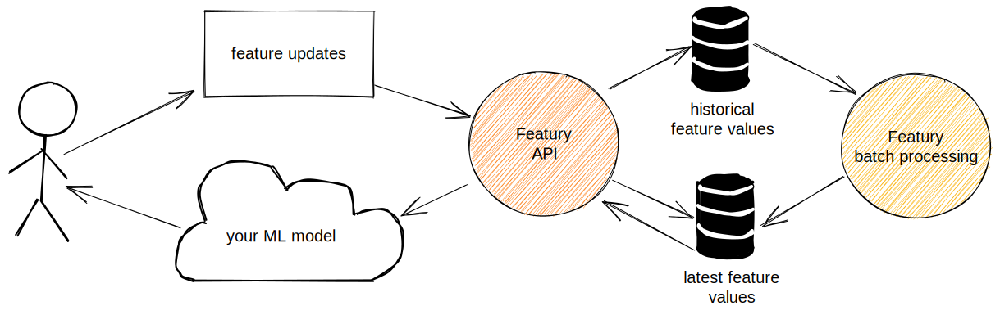

# Featury: An online ML feature store

Featury is an end-to-end framework built to simplify typical scenarios of online-offline ML feature engineering:
* Online API to serve the latest values of ML features.
* Feature value changelog is tracked and persisted into an offline storage (HDFS or S3 bucket).
* Historical ML feature values can be joined with training data offline in Apache Flink to do model training,
  feature bootstrapping and offline evaluation.

It differs from existing solutions like Feast/Hopsworks in the following ways:
* Featury not only handles get-set actions for feature values, but can do stateful processing:
  * increments for counters and periodic counters
  * string frequency sampling
  * numerical stats estimation for median, average and percentiles.
  * bounded lists and maps.
* Platform-agnostic offline model training: feature value histories are plain CSV/JSON/Protobuf/Parquet
  files, so you can use any tool like Spark/Flink/Pandas to do offline training.
* DB-agnostic for online feature reads: can use Redis/Postgres/Cassandra for persistence.
* Stateless and cloud-native: single jar file for local development, single k8s Deployment for production

## Featury is not (only) a feature store

The problem solved by feature stores is typical for majority of production ML system deployments:
* how can you be sure that feature computation is exactly the same while running ML inference online, 
  and training your model offline?
* feature values drift in time, and while doing offline training, you may need to get access to a historical
  values of the feature.
* new features require bootstrapping, so you should be able not only to compute them now, but also for all historical
  actions back in time
* while doing online inference, you may need to access hundreds of features for hundreds of items with low latency

**Featury** tries to solve these problems by encapsulating feature value tracking task:
* it logs all feature value changes, so for any feature you have full historical view of changes.
* Write operations in **Featury** are extremely fast and happening in the background.
* Feature values are eventually recomputed (like computing running median over a sampled reservoir) and exposed
  in inference API.

## Data formats

Featury "ML features" accept a set of operations as an input, for example:
* counter accepts increments
* periodic counter accepts timestamped increments
* scalar accepts puts
* ... etc

These operations are defined as [protobuf structures](https://github.com/findify/featury/blob/master/core/src/main/protobuf/featury.proto),
 so it listens for operations and applies them.

## Components

Featury contains of multiple parts:
1. Online API to serve feature values
2. Online Flink-based data processing job, which accepts operations and modifies the feature values inside.
3. Offline Flink-based historical processing job, which can bootstrap or rebuild feature values.
4. Feature changelog files. Both offline and online jobs are emitting periodic updates to feature values, and the
 complete change history is written to a set of files (on S3, for example)

## Example usage

[Here is](https://github.com/findify/featury/blob/master/examples/src/main/scala/io/findify/featury/example) a small Featury example.

The example is basically doing the following:
* defines feature configuration (so what we're going to compute)
* pipes a set of sample events thru the online Featury job
* joins sample clickthrough with the latest feature values

## Stability and versioning

Featury originally was an internal project within [Findify](http://findify.io), built to simplify the complete ML 
pipeline within the company. Being open-sourced in 2021, it's still used in production to serve workload for 
thousands merchants and tens of millions of monthly unique visitors.

The project is quite young, and maintains a [semantic versioning](https://semver.org/). 
While it's not yet reached v1.0, it has no guarantees on backwards-compatibility both for API and data formats.
  
## License

Featury is licensed under the Apache 2.0.